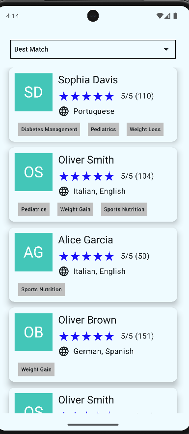

# Nutrium Challenge - Nutrition Appointment Search

## 📌 Project Overview
This project is a functional prototype for searching and displaying nutrition professionals. It consists of two main screens:

1. **Search Professionals Screen**
    - Displays a list of professionals with their profile picture, name, rating, languages, and areas of expertise.
    - Allows sorting by "Best for You" (default), "Rating," and "Most Popular."
    - Implements pagination to fetch more results dynamically.

2. **Professional Profile Screen**
    - Shows detailed information about a selected professional.
    - Includes an expandable "About Me" section with a "Show More" and "Show Less" button.

The app fetches data from a provided HTTP API and supports offline functionality by caching previously fetched data.

---

---

## ▶️ To Run

-  Run the server locally
- Run the application on IDE
- If you want to simulate an error just kill the local server and check the app behavior
---

## 🏗️ Architecture

The project follows **MVVM (Model-View-ViewModel)** architecture with a modular and scalable structure:

- **UI Layer** (Jetpack Compose): Handles the UI and user interactions.
- **ViewModel Layer** (Android ViewModel + StateFlow): Manages UI state and business logic.
- **Repository Layer**: Bridges the UI and Data layers, providing a clean API for accessing and caching data.
- **Data Layer** (Retrofit): Handles network requests.

The project also leverages **Hilt for Dependency Injection**, **Paging 3 for infinite scrolling**, and **Coroutines for asynchronous operations**.

### Caching

- I thought about using Room for caching the lists, but it seemed complicated due to the various types of sorting involved. So, I decided to store the data in memory with a map, providing smoother loading, while minimizing the possibility of inconsistency between local and remote data. Since the runtime will usually not be long enough to create significant differences between the lists, I think this approach should work. However, I still need to consider adding a cache expiration time, like 5 minutes or something similar.

---

## Edge Cases and Considerations

- Professional image url not reachable: I handled this by checking the url before adding to image element and if it is not reachable I print the user name initials, see [ProfessionalImage](app/src/main/java/io/github/joaogouveia89/nutriumchallengejoaogouveia/core/presentation/components/ProfessionalImage.kt)
- Show more has nothing to show more: I used a text measure to check wether the text is being fully showed, if so I just show a toast that there is nothing more to show, in a real app I would just not show show more button, but for this project I show a toast, see [ProfessionalDetailsContent](app/src/main/java/io/github/joaogouveia89/nutriumchallengejoaogouveia/professionalDetails/presenter/ProfessionalDetailsContent.kt) line 111
---

## 📦 Libraries Used

| Library               | Version          | Description                                   |  
|-----------------------|------------------|-----------------------------------------------|  
| Kotlin                | 2.0.0            | Programming language used in the project.     |  
| Jetpack Compose       | 2024.04.01 (BOM) | Modern UI toolkit for Android.                |  
| Lifecycle Runtime KTX | 2.8.7            | Provides lifecycle-aware components.          |  
| Hilt                  | 2.51.1           | Dependency Injection framework.               |  
| Retrofit              | 2.9.0            | HTTP client for network requests.             |  
| OkHttp                | 5.0.0-alpha.2    | Handles HTTP connections.                     |  
| Paging 3              | 3.3.5            | Implements infinite scrolling and pagination. |  
| Coil                  | 3.0.4            | Image loading library optimized for Compose.  |  
| MockK                 | 1.13.7           | Testing framework for Kotlin.                 |  

---

## 🖼️ Screenshots
 

---

## 🚀 Improvements & Next Steps

- **Optimize caching**: Improve offline functionality by implementing a better cache invalidation strategy.
- **Unit & UI Tests**: Increase test coverage, especially for other features apart from professionals list
- **Improve UI/UX**: Add more animations for better user experience.
- **Error Handling**: Rethink error handling

---
